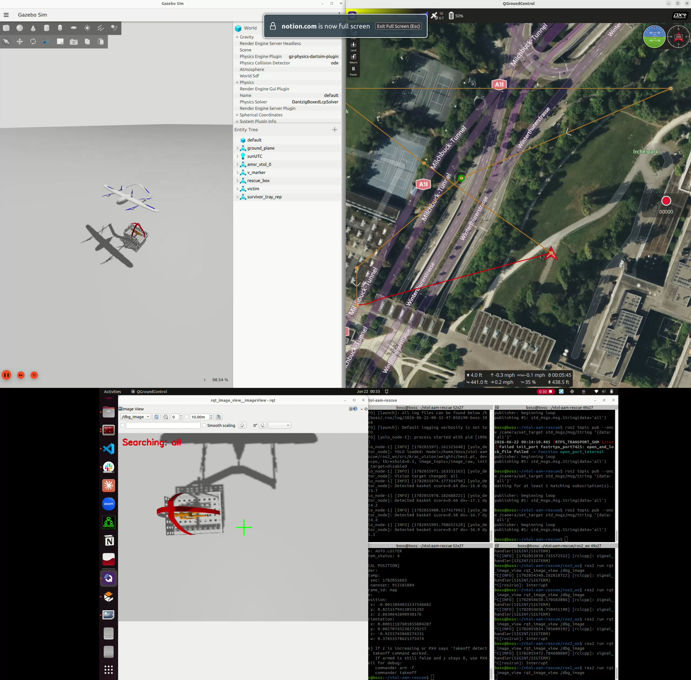

# VTOL AAM Rescue Simulation

PX4 SITL + Gazebo 기반 VTOL AAM 구조 임무 시뮬레이션 프로젝트입니다.

본 프로젝트는 `amsr_vtol`(커스텀) / `standard_vtol`(기본) 기체를 사용하며, MAVROS를 통해 PX4와 ROS 2 노드를 연결하고, YOLO-OBB + ArUco 비전 파이프라인으로 구조 지점 마커를 탐지해 정밀 착륙합니다. 임무 흐름 전체는 BehaviorTree.CPP 기반 `krac_bt_runner`가 제어합니다 (레거시 FSM은 더 이상 기본 경로가 아닙니다 — 아래 "9. 아키텍처 개요" 참고).

## 팀 / 레포 관계 (인수인계 시 가장 먼저 알아야 할 것)

이 레포는 아래 두 팀 레포를 합친 결과물입니다.

| 역할 | 레포 | 담당 |
| --- | --- | --- |
| 베이스(실행 엔진) | 이 레포(`boss123516/vtol-aam-rescue`, `fix/repro-run`) | 영상 |
| 임무 로직 원본 | `cjfgus814123/krac24` (raw `ros2_ws`, README 없음) | 철현 |
| Behavior Tree 이식/운용 | `ros2_ws/src/krac_control` 내 BT 관련 파일 전체 | (이 문서 작성자) |

`krac24`의 FSM(`vtol_fsm.cpp`, `precision_lander.cpp`, `vision_tracker.py`, `mission_loader.py`, waypoint 설계)은 이미 이 레포의 `krac_control`/`krac_vision`으로 이식되어 BT 액션/컨디션 노드로 다시 구현돼 있습니다. **임무 로직(웨이포인트, seq, 착륙 파라미터)의 근거를 찾을 때는 항상 krac24 쪽 원본을 먼저 확인하세요** — 이 레포에 있는 값이 krac24와 다르면 대부분 SITL 월드 좌표 재투영이나 테스트용 임시값이지, 새로운 설계가 아닙니다.

## Demo Screenshot



---

## 1. Current Status (다음 작업자가 가장 먼저 볼 것)

```text
동작 확인됨:
- PX4 SITL(gz_standard_vtol) + Gazebo Harmonic + MAVROS + QGroundControl 통합 실행
- krac_bt_runner(BehaviorTree.CPP) 기반 전체 임무: arm → takeoff → 순찰
  → REP 구조(precision landing stub) → gripper close → resume
  → 복귀 순찰 → 버티포트 최종 착륙 → disarm, 5회 이상 연속 성공 확인
- 두 가지 미션 소스를 스위치로 선택 가능 (way3.plan / krac24.plan, 5절 참고)
- SDL2 기반 실시간 BT 트리 뷰어

아직 안 됨 / 막혀 있음:
- ⚠️ 실제 YOLO 비전 기반 정밀 착륙이 수렴하지 않음 (10절 "정밀 착륙 미해결
  이슈" 필독 — 다음 작업 우선순위 1번)
- drop-zone(투하) 구간: 실제 drop waypoint가 없어 BT에서 통째로 제외됨
- AMSR 커스텀 기체(`gz_amsr_vtol`)는 빌드만 검증, GUI full-mission 미검증
- 매 실행마다 Gazebo가 RAM을 다 먹어 OOM 직전까지 감 (8.1절 필독)
```

---

## 2. Tested Environment

| Item        | Version / Setting           |
| ----------- | --------------------------- |
| OS          | Ubuntu 22.04                |
| ROS 2       | Humble                      |
| PX4         | PX4-Autopilot (main branch, `--no-nuttx` ubuntu.sh) |
| Gazebo      | Gazebo Harmonic / gz-sim8   |
| MAVROS      | ros-humble-mavros / mavros-extras |
| Vision      | YOLOv8-OBB + PyTorch + OpenCV ArUco |
| Image Input | Custom `gz_image_republisher` (11.1절 참고) |

**비전 스택 파이썬 패키지 버전은 반드시 고정할 것** (8.2절 참고):

```bash
pip install --user "numpy<2" "opencv-python==4.10.0.84"
```

원본 환경 가이드(`docs/environment_setup.md`)에는 Gazebo Garden/PX4 v1.14.x 기준 내용도 있으나, 현재 검증 환경은 PX4 main + Gazebo Harmonic입니다.

---

## 3. Repository Structure

```text
vtol-aam-rescue/
├── px4_assets/                     # PX4 ROMFS/에어프레임/gz 모델 패치 원본
│   └── gz/models/ (v_marker, land_marker, box, victim, survivor_tray, amsr_vtol ...)
├── models/survivor_tray/
├── ros2_ws/src/
│   ├── krac_control/                # BT 런타임 (핵심 패키지)
│   │   ├── bt/                      # BT XML 정의
│   │   │   ├── krac_mission_bt_robust.xml   # 원본/기본 BT (way3.plan용)
│   │   │   └── krac_mission_bt_krac24.xml   # krac24.plan 전용 BT 변형
│   │   ├── config/
│   │   │   ├── krac_bt_params.yaml          # 문서용 미러(런타임에 안 읽힘! 9.2절)
│   │   │   └── krac_bt_params_krac24.yaml
│   │   ├── include/krac_control/bt/bt_viewer.hpp
│   │   ├── launch/krac_bt_runner.launch.py
│   │   └── src/
│   │       ├── krac_bt_runner.cpp           # BT 엔트리포인트
│   │       ├── mission_context.cpp          # mavros 연동, 상태/토픽 캐시
│   │       ├── bt_actions_*.cpp / bt_conditions.cpp / bt_register.cpp
│   │       ├── bt_viewer.cpp                # SDL2 실시간 BT 뷰어
│   │       ├── precision_lander.cpp         # 비전 기반 정밀 착륙 PID (10절 이슈 있음)
│   │       ├── vtol_fsm_P.cpp / vtol_fsm.cpp / vtol_offboard.cpp  # 레거시/실험용, BT 경로 아님
│   │       ├── mission_loader.py            # .plan 업로드
│   │       ├── way3.plan                    # 기본 미션 (9항목)
│   │       └── krac24.plan                  # 철현 원본 미션 (14+1항목)
│   ├── krac_vision/krac_vision/vision_tracker.py   # YOLO-OBB + ArUco + 칼만필터
│   ├── krac_mission/                # sitl_vtol.launch.py (PX4/mavros 기동)
│   ├── krac_utils/                  # competition_logger 등
│   ├── krac_interfaces/             # TargetError, FlightPhase 등 커스텀 msg
│   ├── px4_msgs/, px4_ros_com/
├── scripts/
│   ├── run_sitl_bt.sh               # ⭐ 메인 실행 스크립트 (BT 경로)
│   ├── run_sitl.sh                  # 레거시 FSM 경로 (지금은 안 씀)
│   ├── apply_px4_assets.sh
│   ├── auto_spawn.sh                # 마커/구조물 스폰 (REP 좌표 하드코딩, 8.4절)
│   ├── run_gz_image_republisher.sh
│   ├── run_vision_bt.sh
│   ├── collect_bt_debug_logs.sh
│   └── run_bt_debug.sh
└── docs/                            # 세부 기록 (13절 색인 참고)
```

---

## 4. Setup

### 4.1 Apply PX4 Assets

```bash
cd ~/vtol-aam-rescue
./scripts/apply_px4_assets.sh
```

PX4 단독 실행 확인:

```bash
cd ~/PX4-Autopilot
make px4_sitl gz_standard_vtol   # 또는 gz_amsr_vtol (커스텀 기체, GUI 검증은 아직 안 됨)
```

### 4.2 Build ROS 2 Workspace

```bash
cd ~/vtol-aam-rescue/ros2_ws
source /opt/ros/humble/setup.bash
colcon build --symlink-install
source install/setup.bash
```

패키지 단위로 빠르게 재빌드:

```bash
colcon build --symlink-install --packages-select krac_interfaces krac_control krac_utils krac_vision
```

### 4.3 YOLO Weight

`.gitignore`의 `*.pt` 규칙 때문에 Git에 포함되지 않습니다. krac24 레포(또는 팀 공유 경로)에서 아래 위치로 직접 복사해야 합니다.

```text
ros2_ws/src/krac_vision/weights/best.pt
```

확인:

```bash
find ~/vtol-aam-rescue -name "best.pt"
```

> 과거 원본 코드에 있던 `/home/kch/...` 절대경로 하드코딩(`plan_file`, weight 경로)은 이미 제거되어 `ament_index_python`(`get_package_share_directory`) 기반 package-share 상대경로로 바뀌어 있습니다. 새로 이런 하드코딩을 넣지 마세요.

---

## 5. Running the Mission — BT 경로 (기본, 권장)

터미널 하나로 PX4 + Gazebo + MAVROS + gripper bridge + auto-spawn + 비전 + BT 런너까지 전부 기동합니다.

```bash
cd ~/vtol-aam-rescue
source /opt/ros/humble/setup.bash
source ros2_ws/install/setup.bash
./scripts/run_sitl_bt.sh
```

로그는 `/tmp/krac_ros_logs/bt_run_<timestamp>/`에 남습니다 (연결 실패 시 `collect_bt_debug_logs.sh`가 자동으로 진단 로그를 모아줍니다).

### 5.1 자주 쓰는 환경변수

| 변수 | 기본값 | 설명 |
| --- | --- | --- |
| `VEHICLE_MODEL` | `gz_standard_vtol` | `gz_amsr_vtol`로 바꾸면 커스텀 기체 (GUI 미검증) |
| `GZ_MODEL_NAME` | `standard_vtol_0` | AMSR 사용 시 `amsr_vtol_0`로 같이 바꿀 것 |
| `START_VISION_BT` | `true` | YOLO/torch 비전 스택 기동 여부. RAM 아끼려면 `false` |
| `ENABLE_BT_VIEWER` | `false` | 실시간 BT 트리 뷰어 (5.3절) |
| `BT_XML_PATH` / `BT_PARAMS_FILE` | (비어있음=way3.plan) | krac24.plan으로 전환 (5.2절) |
| `MISSION_UPLOAD_STUB_SUCCESS` | `false` | true면 실제 업로드 없이 성공 처리 (BT 로직만 테스트할 때) |
| `GRIPPER_STUB_SUCCESS` | `false` | true면 실제 서보 토픽 없이 그리퍼 성공 처리 |
| `PRINT_BT_TRANSITIONS` | `true` | 터미널에 BT 상태 전이 로그 출력 |

예: AMSR 기체로 비전 없이 빠르게 BT 로직만 확인

```bash
VEHICLE_MODEL=gz_amsr_vtol GZ_MODEL_NAME=amsr_vtol_0 START_VISION_BT=false ./scripts/run_sitl_bt.sh
```

### 5.2 미션 소스 전환: way3.plan ↔ krac24.plan

| | way3.plan (기본) | krac24.plan |
| --- | --- | --- |
| 항목 수 | 9 | 14 + BT가 붙인 안전용 VTOL_LAND 1개 |
| 좌표 출처 | SITL 월드(취리히) 기준 직접 작성 | 철현의 실제 대구 GPS 좌표를 SITL 원점 기준으로 재투영 |
| BT XML | `krac_mission_bt_robust.xml` | `krac_mission_bt_krac24.xml` |
| seq (rescue/resume/landing) | 1 / 2 / 7 | 6 / 7 / 13 (krac24 `vtol_fsm.cpp`의 파라미터 기본값 그대로 이식) |

krac24.plan으로 실행:

```bash
BT_XML_PATH="$(ros2 pkg prefix krac_control)/share/krac_control/bt/krac_mission_bt_krac24.xml" \
BT_PARAMS_FILE="$(ros2 pkg prefix krac_control)/share/krac_control/config/krac_bt_params_krac24.yaml" \
./scripts/run_sitl_bt.sh
```

두 변수를 안 주면 완전히 기존과 동일하게 way3.plan으로 동작합니다 (회귀 없음). 자세한 배경/트러블슈팅 기록은 `~/workspace/hzy/krac24_mission_bt_run_guide.md` 참고 (레포 밖 세션 스크래치 문서 — 필요하면 `docs/`로 옮길 것).

### 5.3 실시간 BT 트리 뷰어 실행법

SDL2/SDL2_ttf 기반으로 현재 실행 중인 BT 트리를 그려주는 디버그 창입니다 (depth별 그리드 배치, 타원=Condition/사각형=Action, 상태별 색상).

**의존성 (최초 1회):**

```bash
sudo apt install -y libsdl2-dev libsdl2-ttf-dev
```

**켜는 법 (`run_sitl_bt.sh` 사용 시, 권장):**

```bash
ENABLE_BT_VIEWER=true ./scripts/run_sitl_bt.sh
```

세로 배치 대신 가로로 보고 싶으면:

```bash
ENABLE_BT_VIEWER=true BT_VIEWER_DIRECTION=Horizontal ./scripts/run_sitl_bt.sh
```

**`ros2 launch`로 직접 켜는 법** (`krac_bt_runner`만 따로 띄울 때):

```bash
ros2 launch krac_control krac_bt_runner.launch.py enable_bt_viewer:=true bt_viewer_direction:=Vertical
```

**뷰어 조작법:**

- 기본은 `auto_fit_ = true` — 창 크기에 맞춰 트리 전체가 자동으로 스케일됩니다.
- 마우스 휠 / `+`,`-` 키: 수동 확대/축소 (이 순간 auto-fit 꺼짐)
- 드래그: 화면 이동
- `r` 키: auto-fit 다시 켜기 (수동 줌/이동 취소하고 트리 전체를 창에 맞춤)
- 기본 창 크기 1500x1000. `DISPLAY`가 설정 안 돼 있으면(`run_sitl_bt.sh`가 자동 감지) 뷰어를 포함한 GUI 프로세스는 통째로 스킵됩니다.

---

## 6. 레거시 FSM 경로 (지금은 쓰지 않음)

`run_sitl.sh` + `run_takeoff.sh` + `run_mission_from_wp1.sh` + `auto_spawn.sh` + `run_vision.sh`를 터미널 여러 개로 나눠 실행하던 예전 방식이 아직 스크립트로는 남아 있습니다. **현재 임무 제어는 전부 BT(`run_sitl_bt.sh`)로 이전되었고, 이 레거시 FSM(`vtol_fsm_P.cpp`)은 BT와 동시 실행하면 충돌하므로 함께 띄우지 마세요.** 참고가 필요하면 git 히스토리의 예전 README나 `docs/HANDOFF_2026-07-06.md`를 확인하세요.

---

## 7. Useful ROS Topics

| Topic | Description |
| --- | --- |
| `/image_raw` | Gazebo 카메라 → ROS Image (커스텀 republisher, 11.1절) |
| `/vision/dbg_image` | YOLO/ArUco 탐지 결과 디버그 이미지 |
| `/vision/target_error` | 정밀 착륙용 타겟 중심 오차 (`krac_interfaces/TargetError`) |
| `/precision_lander/cmd_vel` | `precision_lander_node` 출력 속도 명령 (world/ENU frame으로 취급됨, 10절) |
| `/precision_lander/enable` | 정밀 착륙 on/off 서비스 |
| `/mavros/state` | PX4/MAVROS 연결·arming 상태 |
| `/mavros/local_position/pose` | 로컬 포즈 (position + orientation) |
| `/mavros/mission/reached` | 웨이포인트 도달 이벤트 (BT의 seq 트리거 기준) |
| `/krac/mission_phase` | BT가 퍼블리시하는 현재 임무 단계 |

디버그:

```bash
ros2 topic echo /mavros/state --once
ros2 topic echo /vision/target_error --once
ros2 topic echo /mavros/mission/reached
gz topic -l | grep vtol
```

미션 강제 진행(대기 중인 액션을 넘기고 싶을 때):

```bash
ros2 service call /cmd/mission_proceed std_srvs/srv/Trigger
```

---

## 8. Known Issues (인수인계 시 반드시 읽을 것)

### 8.1 ⚠️ Gazebo 메모리 폭주 — 매 실행마다 OOM 직전까지 감

`gz sim`(커널 로그상 `ruby` 프로세스, gz CLI가 루비 래퍼라서)이 미션 하나 도는 동안(~15분) RSS가 계속 증가해 22GB RAM + 11GB zram swap을 거의 다 채웁니다. 비전 스택(`START_VISION_BT=false`)을 꺼도 마찬가지로 임계치까지 감 — 근본 원인(렌더링 파이프라인 누수 추정)은 아직 못 찾음.

- `run_sitl_bt.sh`의 EXIT trap은 `make px4_sitl`이 spawn한 `gz sim`/`gz sim -g` grandchild 프로세스까지는 못 죽입니다.
- **매 실행 후 반드시 확인:**
  ```bash
  pgrep -af "gz sim"
  ```
  남아있으면 PID로 직접 `kill -9`. 안 하면 다음 실행이 바로 OOM으로 죽습니다.
- 실제로 커널 OOM killer가 `gz sim`을 강제 종료한 사례 확인됨 (`journalctl -k | grep oom`).

### 8.2 numpy2 / cv_bridge ABI 불일치

`pip install --user opencv-python`을 그냥 설치하면 numpy 2.x가 딸려 들어와서 apt로 깔린 `cv_bridge`(numpy1 ABI로 빌드됨)가 `AttributeError: _ARRAY_API not found`로 즉시 죽습니다 (`yolo_node`/`vision_tracker` 첫 프레임에서 세그폴트). 반드시:

```bash
pip install --user "numpy<2" "opencv-python==4.10.0.84"
```

### 8.3 PX4 미션 아이템 파라미터 검증이 엄격함

이 머신의 PX4(main 브랜치, `src/modules/mavlink/mavlink_command_params.hpp`)는 mission-item마다 허용되는 파라미터 마스크를 엄격히 검사합니다.

- `VTOL_LAND`(command 85) mission-item은 `param1~3`이 반드시 0이어야 함 (0이 아니면 `param3 has an invalid value`로 업로드 자체가 거부됨 — mission-item에서는 어차피 안 읽는 값이라 기능 손실 없음).
- `frame=2`(`MAV_FRAME_MISSION`, 좌표 없는 DO 계열) 항목은 좌표를 절대 재투영하지 말고 0으로 채울 것. krac24.plan 원본에 있던 placeholder 좌표(35, 128)를 그대로 재투영해서 올렸다가 `param5 has an invalid value`로 거부당한 사례 있음.
- 미션 마지막에 착륙 아이템(`MAV_CMD_NAV_VTOL_LAND`)이 없으면 `mission_feasibility_checker`가 "Landing waypoint/pattern required"로 미션 자체를 거부해 arm이 안 됩니다 (krac24.plan은 원본에 이게 없어서, BT용 사본 끝에 추가해둠).

### 8.4 QGroundControl 없이 실행하면 arm이 거부됨

`NAV_DLL_ACT > 0`이면 PX4 `rcAndDataLinkCheck`가 GCS 연결을 요구합니다 (mavros는 companion computer라 이 조건을 못 채움). `run_sitl_bt.sh`가 MAVROS 연결 직후 `NAV_DLL_ACT=0`을 자동으로 설정해서 이미 해결돼 있습니다 (way3.plan/krac24.plan 둘 다 적용됨). 직접 다른 launch로 띄울 때는 이 파라미터를 잊지 마세요.

### 8.5 QGroundControl 웨이포인트가 안 보임 (Cosmetic)

mavros가 컴패니언 컴퓨터로서 미션을 업로드해도 QGC는 최초 연결 시점에만 미션 리스트를 자동 요청합니다. 업로드 후 Plan 탭을 재진입하거나 재연결해야 최신 웨이포인트가 보입니다 — 미션이 깨진 게 아닙니다.

### 8.6 `krac_bt_params*.yaml`이 실제로는 안 읽힘 (설계상 함정)

`krac_bt_params.yaml`/`krac_bt_params_krac24.yaml`의 `rescue_wp_seq`/`resume_wp_seq`/`landing_wp_seq`는 **문서용 미러일 뿐, BT 노드가 실제로 읽지 않습니다.** `WaitForWaypointReached`/`AlignHeadingToWaypoint`/`SetMissionCurrentWaypoint`는 각 BT XML(`krac_mission_bt_robust.xml` / `krac_mission_bt_krac24.xml`)에 **리터럴로 박힌 `seq="..."` 속성값**을 그대로 씁니다. `mission_context.cpp`에 `rescueWpSeq()` 같은 접근자가 있지만 아무도 호출 안 함.

**→ .plan 파일의 항목 순서/개수를 바꾸면 반드시 해당 BT XML의 `seq=` 값도 같이 수정해야 합니다.** yaml만 고치고 XML을 안 고치면 아무 효과 없이 조용히 틀린 웨이포인트를 기다리게 됩니다.

### 8.7 `auto_spawn.sh`의 REP 좌표가 미션별로 하드코딩됨

`scripts/auto_spawn.sh`는 REP(구조 지점) 마커를 스폰할 때 home 기준 (east, north) 오프셋이 필요한데, 이게 plan 파일에서 자동 계산되는 게 아니라 수동으로 맞춰둔 값입니다. `run_sitl_bt.sh`가 `BT_XML_PATH`에 `"krac24"`가 들어있으면 `AUTO_SPAWN_REP_E=-26.03`/`AUTO_SPAWN_REP_N=-31.41`로 자동 전환해주지만, **새로운 세 번째 미션 변형을 추가한다면 이 자동 전환 로직도 같이 늘려야 합니다** (`AUTO_SPAWN_REP_E`/`AUTO_SPAWN_REP_N` 환경변수로 직접 오버라이드도 가능).

`v_marker`(비전 인식용 fiducial, 출발/버티포트용)와 `land_marker`(적십자, 구조 지점용)는 과거 서로 반대 위치에 스폰되던 버그가 있었고 수정 완료됨 — 새 월드/모델을 추가할 때 이 매핑이 다시 꼬이지 않았는지 확인할 것.

---

## 9. 아키텍처 개요

```text
run_sitl_bt.sh
├── PX4 SITL + Gazebo (via krac_mission/sitl_vtol.launch.py, start_fsm:=false)
├── MAVROS
├── gripper servo bridge (ros_gz_bridge, /model/<name>/servo_4~6)
├── auto_spawn.sh            → Gazebo에 마커/구조물 스폰
├── run_gz_image_republisher.sh → Gazebo 카메라 → /image_raw
├── run_vision_bt.sh         → vision_tracker.py (YOLO-OBB + ArUco + 칼만필터)
│                               → /vision/target_error
├── precision_lander_node    → /vision/target_error 구독, /precision_lander/cmd_vel 발행
└── krac_bt_runner           → mission_context.cpp가 mavros 상태/토픽을 캐시,
                                bt_actions_*.cpp/bt_conditions.cpp가 BT 노드 구현,
                                BT XML(way3 or krac24)이 실제 흐름 정의
```

핵심 파일 하나만 봐야 한다면:

- 임무 흐름/순서: `ros2_ws/src/krac_control/bt/krac_mission_bt_*.xml`
- BT 노드 구현: `ros2_ws/src/krac_control/src/bt_actions_*.cpp`, `bt_conditions.cpp`
- mavros/토픽 상태 관리: `ros2_ws/src/krac_control/src/mission_context.cpp`
- 정밀 착륙 제어 (현재 이슈 있음): `ros2_ws/src/krac_control/src/precision_lander.cpp`

---

## 10. ⚠️ 정밀 착륙(Precision Landing) 미해결 이슈 — 다음 작업 최우선

**현재 상태**: `krac_mission_bt_krac24.xml`의 `RescueOperationAttempt`/`FinalLandingAttempt`는 스텁(`DeactivateYOLO`+고정 고도 홀드)이 아니라 **실제 비전 파이프라인**(`ActivateYOLO` → `WaitForPrecisionTarget` → `EnablePrecisionLander` → `PrecisionLandOnTarget`)으로 복원되어 있는 상태입니다. YOLO-OBB 탐지 자체는 정상 동작합니다.

**증상**: SITL 실측(`START_VISION_BT=true`)에서 OFFBOARD 진입 시 초기 오차가 13m로 매우 컸고, PID가 처음엔 오차를 줄였지만(14.8m → 6.6m, ~40초) 이후 다시 발산(6.6m → 11m+)해 60초 타임아웃 후 타겟을 완전히 잃고, 이 시점 근처에서 SITL 자체가 죽는 패턴이 반복 재현됨.

**원인 진단 (코드 레벨로 확인 완료, 아직 미수정)**: `precision_lander.cpp`의 버그입니다. BT 시퀀싱 문제가 아닙니다.

1. `vision_tracker.py`가 계산하는 `pixel_err_x/y`는 기체에 고정된(짐벌 없음) 하방 카메라 기준 오차 → **기체 body frame**. 기체가 yaw 회전하면 이 오차의 "앞/뒤/좌/우" 의미도 같이 회전함.
2. `precision_lander.cpp::control_loop()`(45~138행)는 이 body-frame 오차로 `v_x`/`v_y`를 계산해서 부호만 한 번 바꾸는 임시방편(`-v_y`)을 거쳐 그대로 `/precision_lander/cmd_vel`로 내보냅니다. **현재 yaw를 전혀 읽지 않음** — `pose_cb()`(73~75행)는 orientation 없이 `position.z`만 뽑아 씀.
3. 이 토픽은 `mission_context.cpp::precisionLanderVelCb()`를 거쳐 그대로 `mavros/setpoint_velocity/cmd_vel_unstamped`로 전달되는데, 이 토픽은 이 코드베이스 전체 관례상 **world/ENU frame**으로 쓰입니다 (같은 파일의 `FlyToLocalPoint`가 world-frame dx/dy를 그대로 이 토픽에 보내는 것으로 확인). `mission_context.cpp::currentYaw()`가 이미 구현돼 있어서 다른 BT 노드(`AlignHeadingToWaypoint`)는 이걸 정상적으로 씀.
4. 즉 **body-frame 오차를 회전 변환 없이 world-frame 속도 명령처럼 보내고 있음.** `precision_lander.cpp`는 동시에 마커 각도에 맞춰 yaw도 능동적으로 돌리므로(`KP_YAW`, 90도 스냅), 하강 초반엔 헤딩이 우연히 맞아 수렴하다가, 정렬을 위해 기체가 실제로 회전하는 순간부터 world-frame으로 잘못 해석된 보정 벡터가 엉뚱한 방향을 가리켜 다시 발산 — 실측 로그 패턴과 정확히 일치.

**다음 작업자가 할 일 (우선순위 순):**

1. `precision_lander.cpp`의 `pose_cb`가 orientation도 구독하도록 하고, `mission_context.cpp::currentYaw()`와 동일한 방식으로 yaw를 추출.
2. `err_x_m`/`err_y_m`(122행 부근)을 world-frame으로 내보내기 전에 현재 yaw만큼 2D 회전행렬로 회전시킬 것. 지금의 `-v_y` 부호 반전 핫픽스는 이 회전을 대체하지 못하고, 헤딩이 바뀔 때마다 다시 어긋남.
3. 수정 후 `START_VISION_BT=true`로 재검증 (krac24.plan 기준 `krac24_run_11+`). 성공 기준: REP 도착 후 오차가 단조 감소해 `PrecisionLandOnTarget`의 `target_altitude_m` 임계값(0.8m/0.25m) 도달.
4. 그래도 초기 13m 오차 자체가 너무 크다면, OFFBOARD 진입 전 미션 도달 허용오차(REP 웨이포인트 근처)를 더 타이트하게 좁히는 것도 병행 검토.
5. 확실히 성공하는 데모가 급하면 임시로 스텁(`DeactivateYOLO`+`FlyToAltitude(hold_latlon=true)`+`Delay`)으로 되돌리는 것도 옵션 — 이전 텍스트는 git 히스토리에 남아 있음.

BT 뷰어 auto-fit(5.3절)와 마커 위치 수정(8.7절)은 이 이슈와 무관하게 이미 안정적으로 동작 확인됨.

---

## 11. 기타 알려진 이슈

### 11.1 ros_gz_image / ros_gz_bridge 이미지 미전달

Gazebo Harmonic 환경에서 `ros_gz_image`/`ros_gz_bridge`로 브리지하면 `/image_raw` 토픽은 생기지만 프레임이 흐르지 않는 문제가 있어, `gz topic`을 subprocess로 호출하는 커스텀 republisher(`scripts/run_gz_image_republisher.sh`)를 대신 씁니다. 약 0.5~1.5Hz 수준이며 시뮬레이션 검증용 workaround입니다 (Jetson 배포 구조 아님, 12절 참고).

### 11.2 YOLO Always-On Load

현재 YOLO는 `/image_raw`가 들어올 때마다 계속 inference를 수행합니다. 실기체(Jetson)에서는 rescue waypoint 도착 시에만 활성화하는 구조가 적합합니다 (`/camera/set_target`으로 on/off 제어하는 인터페이스는 이미 있음).

### 11.3 Public repo 주의

원본 handoff 자료에 Roboflow API 키가 담긴 문서가 있었습니다. 그 문서/키는 커밋하지 마세요.

---

## 12. Jetson Nano Deployment Note

Jetson에서는 Gazebo image bridge가 필요 없습니다. 실제 CSI/USB 카메라 → Jetson YOLO node → `/camera/target_error` → MAVROS/PX4 companion control 구조를 그대로 쓰면 됩니다. 비교해봐야 할 것: YOLOv8 PyTorch vs ONNX vs TensorRT FPS, 입력 해상도 640x480 vs 320x240, `target_error` publish rate.

---

## 13. 문서 색인 (docs/)

| 파일 | 내용 |
| --- | --- |
| `docs/HANDOFF_2026-07-06.md` | FSM→BT 전환 배경, 핵심 변경 요약 |
| `docs/RUN_COMMANDS.md` | 설치 후 바로 쓰는 명령어 모음 |
| `docs/krac24_integration.md` | krac24 FSM → BT 이식 설계 기록 |
| `docs/code_map.md` | 주요 코드 위치 |
| `docs/known_issues.md` | 초기 클린업 체크리스트 (일부는 이미 해결됨) |
| `docs/standard_vtol_bt_test_summary_2026-07-05.md` | standard VTOL BT 테스트 요약 |
| `docs/standard_vtol_bt_gripper_full_validation_2026-07-06.md` | 그리퍼 포함 full validation 기록 |
| `docs/test_sequence.md` | 점검 명령 모음 |
| `docs/environment_setup.md` | 환경 설치 가이드 (PX4 버전 표기가 현재와 다를 수 있음) |

세션 스크래치 문서(레포 밖, `~/workspace/hzy/`)도 참고 가치가 있습니다 — 필요하면 `docs/`로 옮겨서 커밋하는 것을 권장합니다.

- `krac24_mission_bt_run_guide.md`: krac24.plan BT 변형의 전체 트러블슈팅 기록 (좌표 재투영, seq 근거, PX4 파라미터 검증 이슈 등 8절 내용의 원본).
